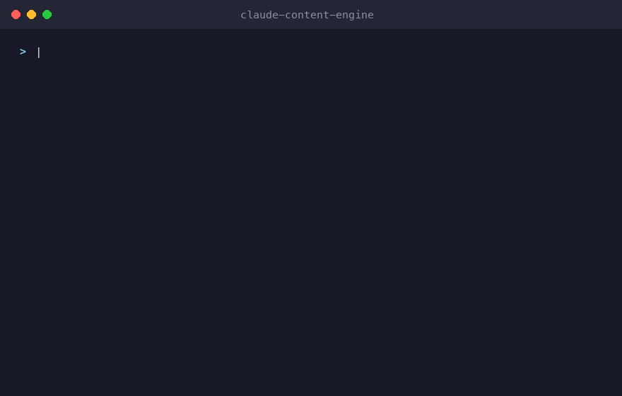

<div align="center">

# claude-content-engine

**A content creation engine for Claude Code.**

9 specialized skills. Persistent memory. A quality gate that kills AI slop. A learning loop that studies what performed.<br>
Install in one command. Zero config.

[](https://github.com/quionie/claude-content-engine/actions/workflows/ci.yml)
[](LICENSE)
[](#skills)
[](https://claude.com/claude-code)

[Website](https://claude-content-engine-quionie.vercel.app) · [Install](#install) · [Skills](#skills) · [Advanced Features](#advanced-features) · [Changelog](CHANGELOG.md) · [Contributing](CONTRIBUTING.md)



</div>

---

## Why this exists

**claude-content-engine** installs 9 content skills, a persistent memory system, an automatic slop detector, and a learning loop that updates the engine's own guidance from your real results into Claude Code. One command, zero config.

You just ask naturally:

```
> Turn this blog post into a Twitter thread, LinkedIn post, and newsletter snippet
```

Claude picks the right skill, loads your saved voice profile, writes all three pieces, and the quality gate checks the output automatically before you see it.

## Install

From inside Claude Code:

```
/plugin marketplace add quionie/claude-content-engine
/plugin install claude-content-engine@claude-content-engine
```

Or from your terminal:

```bash
curl -fsSL https://raw.githubusercontent.com/quionie/claude-content-engine/main/install.sh | bash
```

Then run `/reload-plugins` in an open session (or restart Claude Code). Done.

Requires Claude Code with plugin support, plus `python3` for the quality gate hooks. The skills work fine without python3 - you just lose the automatic slop detection.

<details>
<summary>Update / uninstall</summary>

**Update:**
```
/plugin marketplace update claude-content-engine
/plugin install claude-content-engine@claude-content-engine
```
The second command matters: refreshing the marketplace only updates the catalog, and auto-update is off by default for third-party marketplaces, so reinstalling is what actually picks up the new version. Or run `./install.sh --update` from the terminal, which does both.

**Uninstall:**
```
/plugin uninstall claude-content-engine@claude-content-engine
/plugin marketplace remove claude-content-engine
```
or `./install.sh --uninstall` from the terminal.

Uninstalling leaves your content memory at `~/.claude-content-engine/` in place. Remove it with `rm -rf ~/.claude-content-engine` if you want a clean slate.

</details>

## Skills

### Core Skills

| Skill | What it does | Example prompt |
|:------|:-------------|:---------------|
| **Content Repurposer** | Transforms one piece of content into multiple platform-native formats | *"Repurpose this blog post for Twitter, LinkedIn, and my newsletter"* |
| **Blog Post Architect** | SEO-optimized blog posts with structure, meta descriptions, and internal linking strategy | *"Write a blog post about async communication for remote teams"* |
| **Copywriting Engine** | Headlines, taglines, landing pages, ad copy - using PAS, AIDA, and BAB frameworks | *"Write landing page copy for a project management tool"* |
| **Brand Voice Builder** | Analyzes writing samples and outputs a reusable voice profile document | *"Analyze these 5 blog posts and capture my writing voice"* |
| **Email Sequence Builder** | Full email drip campaigns - welcome, launch, onboarding, re-engagement, abandoned cart | *"Build a 7-email welcome sequence for my SaaS"* |
| **Social Media Calendar** | Generates a week or month of scheduled social content with platform-specific formatting | *"Create 2 weeks of social media content for my startup"* |

### Advanced Skills

| Skill | What it does | Example prompt |
|:------|:-------------|:---------------|
| **Content Workflow** | Runs multiple skills in sequence - output from one feeds into the next | *"Analyze my voice, write a blog post in it, then repurpose for social"* |
| **Content Memory** | Stores your voice, audience, pillars, and preferences across sessions | *"Remember my brand voice for future sessions"* |
| **Content Retro** | Analyzes real performance data and updates the engine's own guidance | *"Run a content retro - here are last month's numbers"* |

## Advanced Features

Skills, memory, and hooks working together.

### 1. Skill Chaining

You can chain skills together. The output from one step gets used as input for the next.

```
Step 1: Brand Voice Builder   → extracts your voice from samples
            ↓ voice profile
Step 2: Blog Post Architect   → writes a post in your voice
            ↓ blog post
Step 3: Content Repurposer    → creates Twitter thread + LinkedIn + newsletter
            ↓ 3 content pieces
Step 4: Social Media Calendar  → schedules everything into a 2-week plan
```

**5 pre-built workflows included:** Content Machine, Brand Launch Kit, Blog-to-Everywhere, Voice-First Content Sprint, and Email Empire. Or just describe what you want and it'll pick the right skills to run in sequence.

### 2. Content Memory

Your content context persists across sessions. No more re-explaining your brand every time.

```
~/.claude-content-engine/memory/
├── voice-profile.md     ← saved automatically after Brand Voice Builder runs
├── content-pillars.md   ← your recurring themes and topics
├── audience.md          ← who you're writing for
├── style-prefs.md       ← "don't use emojis", "always be casual", etc.
├── top-content.md       ← log of your best-performing posts
└── context.md           ← product, positioning, competitors
```

Memory is **local-only** (stored on your machine, never uploaded), **opt-in** (you control what's saved), and **auto-loaded** (skills reference it automatically so you don't repeat yourself).

### 3. Quality Gate (AI Slop Detector)

A hook that runs automatically on every piece of content Claude writes. Roughly 50 patterns across three severity tiers:

- **Hard slop** - "delve", "tapestry", "in today's fast-paced world", "it's important to note", "game-changer", and friends
- **Soft slop** - "let's dive in", "as we've seen", "seamlessly", "the landscape of" - flagged when multiple appear together
- **Weak copy** - "very good", "in order to", "I think that" - with specific rewrite suggestions
- **Fake enthusiasm** - excessive exclamation marks that read as performative

Claude gets the feedback and rewrites before you see the final output. You don't have to do anything.

```
PostToolUse hook → scans content files Claude writes → feeds findings back
                   into Claude's context → Claude rewrites before finishing
Stop hook       → scans Claude's final message → blocks completion if it
                   contains multiple hard-slop phrases → Claude fixes it first
```

The gate is tuned to stay out of your way: it only scans content files (`.md`, `.txt`, `.html` - never code), the final-message check only fires on substantial responses with three or more hard-slop hits, and it never blocks the same response twice. Words that are ordinary in technical conversation ("robust", "leverage", "seamless") are treated as soft signals rather than hard ones, so the gate won't nag you in coding sessions, and usage like "robust error handling" or "leverage ratio" is allowlisted entirely.

**Your own banned phrases.** Every writer has personal cringe words. Add them to `~/.claude-content-engine/banned-phrases.txt`, one per line, and the gate treats them as must-fix:

```
# phrases I never want in my content
circle back
synergize
at scale
```

Matching is case-insensitive and whole-word. Lines starting with `#` are ignored. You can also just tell Claude "never say X in my content" - the Content Memory skill saves it there for you.

### 4. The Learning Loop

Most content tools stop at drafting. This one closes the loop:

```
draft → publish → log → measure → learn → better draft
```

Every published piece gets logged to `content-log.md`. When you run a content retro - with connected analytics tools, or by just pasting your numbers - the engine compares winners against losers, extracts findings with real evidence behind them ("question hooks averaged 2.4x median impressions across 9 threads"), and writes them to `learnings.md`. Solid findings become drafting defaults; promising ones become tracked experiments the next retro grades.

The guardrails: findings need at least 5 data points before they become rules, effect sizes are reported rather than vibes, and your voice profile is never edited automatically - performance data tunes tactics, but your voice is yours.

## How It Works

Skills are `.md` files with YAML frontmatter. Claude reads the `description` field and auto-activates the right skill based on your prompt. No slash commands needed.

```yaml
---
name: skill-name
description: When to activate this skill (trigger conditions)
version: 1.0.0
---

# Skill Name
[Detailed instructions for Claude]
```

The hooks are Python scripts that run via Claude Code's [hook system](https://code.claude.com/docs/en/hooks). The PostToolUse hook returns findings as `additionalContext`, which Claude Code injects into Claude's context so it self-corrects. The Stop hook checks the final message and can block completion until flagged phrases are rewritten.

## Architecture

```
claude-content-engine/
├── skills/                        # 9 content skills
│   ├── content-repurposer/SKILL.md
│   ├── blog-post-architect/SKILL.md
│   ├── copywriting-engine/SKILL.md
│   ├── brand-voice-builder/SKILL.md
│   ├── email-sequence-builder/SKILL.md
│   ├── social-media-calendar/SKILL.md
│   ├── content-workflow/SKILL.md       ← skill chaining orchestrator
│   ├── content-retro/SKILL.md          ← the learning loop
│   └── content-memory/SKILL.md         ← persistent content memory
├── hooks/                         # quality gate system
│   ├── hooks.json                      ← hook configuration
│   ├── slop_patterns.py                ← shared pattern library + scanner
│   ├── quality_gate.py                 ← PostToolUse AI slop detector
│   └── content_review.py               ← Stop hook final pass
├── tests/
│   └── test_hooks.py              # hook test suite (python3, no deps)
├── .claude-plugin/
│   ├── plugin.json                # plugin manifest
│   └── marketplace.json           # marketplace catalog (this repo is both)
├── .github/workflows/ci.yml      # tests + lint on every push
├── install.sh                     # one-line installer
├── CONTRIBUTING.md
└── LICENSE
```

## FAQ

<details>
<summary><strong>Do I need a specific Claude plan?</strong></summary>
Skills work with any Claude Code subscription that supports custom skills and hooks.
</details>

<details>
<summary><strong>Can I use only some skills?</strong></summary>
Yes. Delete any <code>skills/&lt;name&gt;/</code> directory you don't want. The remaining skills work independently.
</details>

<details>
<summary><strong>Will these conflict with my existing skills?</strong></summary>
Shouldn't. Claude picks the most relevant skill based on your prompt. If you have overlapping skills, you can always delete the one you don't want.
</details>

<details>
<summary><strong>Can I disable the quality gate?</strong></summary>
Yes. Remove the entries from <code>hooks/hooks.json</code> in your installed copy of the plugin, then run <code>/reload-plugins</code>. The skills work fine without it.
</details>

<details>
<summary><strong>Where is memory stored?</strong></summary>
Locally at <code>~/.claude-content-engine/memory/</code>. Nothing is uploaded. Run <code>rm -rf ~/.claude-content-engine</code> to wipe it.
</details>

<details>
<summary><strong>Can I modify skills?</strong></summary>
Yes. They're markdown files. Edit them, fork them, rewrite them entirely.
</details>

## Contributing

New skills are accepted. See [CONTRIBUTING.md](CONTRIBUTING.md) for the format and quality checklist.

## License

[MIT](LICENSE)
